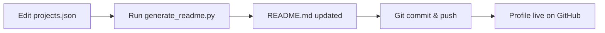

# SH1W4 Profile Repository - Context Map

## 🎯 Repository Purpose
This is the **official GitHub Profile README** for SH1W4 (Symbiotic Human-AI Workflow Architect).
It serves as a professional portfolio, brand identity, and technical showcase.

**SH1W4 Acronym:** **S**ymbiotic **H**uman-**AI** **W**orkflow **Architect**

## 🧬 Philosophy
**Core Concept:** Augmented Intelligence - the fusion of human creativity with AI precision.
**Positioning:** Not AI vs Human, but AI *amplifying* Human.
**Tagline:** `[ HUMAN VISION ] | [ AGENTIC EXECUTION ] | [ SYMBIOTIC RESULT ]`

## 📂 File Structure & Purpose

### Visual Assets
- `header_final.png` - Main banner (biocybernetic aesthetic, 3000x800px, cropped)
- `dna_spinner.svg` - Animated DNA helix (SMIL-based, GitHub-safe)
- `vireon_demo.gif` - Terminal demo showing agentic orchestration
- `biostats.svg` - Dynamically generated "organism status" card

### Core Content
- `README.md` - **Main profile page** (auto-generated from projects.json)
- `projects.json` - **Project database** (source of truth for portfolio)
- `generate_readme.py` - **Generator script** (rebuilds README from JSON)
- `PROJECTS_GUIDE.md` - Documentation for managing projects

### Automation
- `.github/workflows/snake.yml` - Generates contribution snake animation
- `.github/workflows/update_biostats.yml` - Updates biostats.svg every 6h
- `generate_biostats.py` - Python script for biostats generation

### Configuration
- `.gitignore` - Excludes temp files and admin scripts
- `CONTEXT.md` - This file (IDE/Agent context map)

## 🔄 How It Works

### 1. Projects Management

### 2. Visual Updates
- **Snake Animation:** Auto-generated daily via GitHub Actions
- **BioStats:** Auto-generated every 6 hours via GitHub Actions
- **Static Assets:** Manual update (banner, GIFs, SVGs)

### 3. Content Philosophy
- **Minimalism:** Clean, no clutter
- **Professionalism:** Enterprise-grade English
- **Uniqueness:** Biocybernetic aesthetic (green/purple neon)
- **Proof of Work:** Demo GIFs, not just text

## 🎨 Design System

### Color Palette
- `#0D1117` - GitHub Dark Dim (background)
- `#00FF41` - Bio Green (primary accent)
- `#BD93F9` - Synth Purple (secondary accent)
- `#C9D1D9` - Text Gray

### Typography
- Headers: Monospace aesthetic (code-like)
- Body: Clean sans-serif
- Emoji: Used strategically for icons

### Animations
- DNA Spinner: Continuous rotation (symbolizes evolution)
- Terminal Demo: Loop showing code execution
- Snake: Eats contribution history (gamification)

## 🤖 For AI Agents / IDEs

### Primary Tasks
1. **Update Projects:** Edit `projects.json`, run `generate_readme.py`
2. **Fix Bugs:** Check `.github/workflows/` if automations fail
3. **Add Assets:** Place in root, reference in README.md
4. **Maintain Brand:** Keep biocybernetic aesthetic consistent

### DO NOT
- Modify README.md directly (always regenerate via script)
- Change color palette without updating `.context.md`
- Remove automation workflows
- Break the table structure in projects section

### Key Conventions
- Commit messages: Use conventional commits (feat:, fix:, docs:)
- File naming: lowercase_with_underscores
- Image optimization: Keep PNGs under 500KB, GIFs under 200KB

## 📊 Success Metrics
This profile aims to achieve:
- ✅ Visual cohesion (biocybernetic theme)
- ✅ Technical authority (MCP, Rust, Python stack)
- ✅ Professional positioning (Augmented Developer)
- ✅ Scalability (modular project management)

## 🔗 External References
- Main Portfolio: https://github.com/SH1W4
- Organization: symbeon-labs (Legal AI products)
- Organization: vireon-core (Agentic Infrastructure)

---

**Last Updated:** 2025-12-07
**Maintained By:** JX // SH1W4 (neo.sh1w4@gmail.com)
