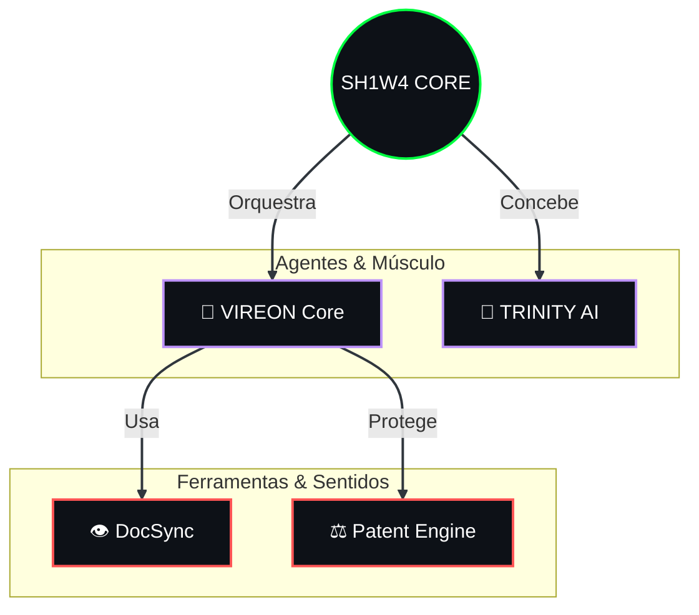

# 🧠 Análise Criativa & Sugestões de Evolução (SH1W4 v2.1)

Seu perfil já está **muito acima da média**. O tema "Organismo Cibernético" é consistente e a automação do SVG (`biostats.svg`) deu "vida" a ele.

Para elevar o nível de **"Architect"** para **"Demiurge"** (Criador de Mundos), aqui estão 3 sugestões criativas:

## 1. O "Mapa Neural" dos Projetos (Substituir/Aumentar a Tabela)
Tabelas são para humanos normais. Arquitetos usam grafos.
Podemos adicionar um diagrama Mermaid que mostra como seus projetos se conectam, reforçando a ideia de **Ecossistema** e não apenas "lista de apps".

**Exemplo Visual (Mermaid):**


## 2. "Easter Eggs" no Código Fonte
Devs curiosos olham o `Raw` do README. Vamos deixar mensagens para eles, como logs de um sistema bootando.

**Sugestão (Adicionar no topo do README):**
```html
<!-- 
SYSTEM_BOOT_SEQUENCE:
> LOADER: v2.1.0 ... OK
> NEURAL_LINK: ESTABLISHED
> TARGET: RECRUITER_RETINA ... LOCKED
> MESSAGE: "Não procure empregados. Procure co-pilotos."
-->
```

## 3. Rodapé "Terminal Status"
Ao invés dos badges normais no final, que tal uma "Barra de Status" simulada?

```text
root@symbeon:~# ./status_check.sh
> UPTIME: 99.9%
> COFFEE__LEVEL: CRITICAL
> NEXT_GOAL: AGI_INTEGRATION
[█▒▒▒▒▒▒▒▒▒] 12% COMPLETE
```

## 🎯 Minha Recomendação
Implemente o **Grafo Mermaid** agora. É visualmenta impactante e prova sua habilidade de arquitetura sistêmica instantaneamente.
