# 🧠 Análise Criativa & Sugestões de Evolução (SH1W4 v2.1)

Seu perfil já está **muito acima da média**. O tema "Organismo Cibernético" é consistente e a automação do SVG (`biostats.svg`) deu "vida" a ele.

Para elevar o nível de **"Architect"** para **"Demiurge"** (Criador de Mundos), aqui estão 3 sugestões criativas:

## 1. O "Mapa Neural" dos Projetos (Substituir/Aumentar a Tabela)
Tabelas são para humanos normais. Arquitetos usam grafos.
Podemos adicionar um diagrama Mermaid que mostra como seus projetos se conectam, reforçando a ideia de **Ecossistema** e não apenas "lista de apps".

**Exemplo Visual (Mermaid):**

```mermaid
graph TD
    %% Estilo Cyberpunk Minimalista
    classDef brain fill:#0d1117,stroke:#00ff41,stroke-width:2px,color:#fff;
    classDef muscle fill:#0d1117,stroke:#bd93f9,stroke-width:2px,color:#fff;
    classDef tool fill:#0d1117,stroke:#ff5555,stroke-width:2px,color:#fff;

    Hub((SH1W4 CORE)):::brain
    
    subgraph "Agentes & Músculo"
        VIREON[🧬 VIREON Core]:::muscle
        TRINITY[🧠 TRINITY AI]:::muscle
    end

    subgraph "Ferramentas & Sentidos"
        DOCSYNC[👁️ DocSync]:::tool
        PATENT[⚖️ Patent Engine]:::tool
    end

    Hub -->|Orquestra| VIREON
    Hub -->|Concebe| TRINITY
    VIREON -->|Usa| DOCSYNC
    VIREON -->|Protege| PATENT
    
    linkStyle default stroke:#30363d,stroke-width:2px;
```


## 2. "Easter Eggs" no Código Fonte
Devs curiosos olham o `Raw` do README. Vamos deixar mensagens para eles, como logs de um sistema bootando.

**Sugestão (Adicionar no topo do README):**
```html
<!-- 
SYSTEM_BOOT_SEQUENCE:
> LOADER: v2.1.0 ... OK
> NEURAL_LINK: ESTABLISHED
> TARGET: RECRUITER_RETINA ... LOCKED
> MESSAGE: "Não procure empregados. Procure co-pilotos."
-->
```

## 3. Rodapé "Terminal Status"
Ao invés dos badges normais no final, que tal uma "Barra de Status" simulada?

```text
root@symbeon:~# ./status_check.sh
> UPTIME: 99.9%
> COFFEE__LEVEL: CRITICAL
> NEXT_GOAL: AGI_INTEGRATION
[█▒▒▒▒▒▒▒▒▒] 12% COMPLETE
```

## 🎯 Minha Recomendação
Implemente o **Grafo Mermaid** agora. É visualmenta impactante e prova sua habilidade de arquitetura sistêmica instantaneamente.
