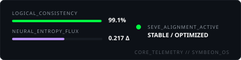
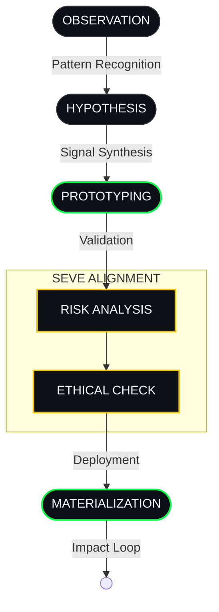

<!--
    SH1W4 — PROFILE V2
    Identity: Symbiotic Human-AI Workflow Architect
    Principle: Human Vision + Agentic Execution → Symbiotic Result
    Method: Observation → Hypothesis → Prototyping → Risk Analysis → Ethical Check → Materialization
-->

<div align="center">
  
</div>

<div align="center">
  
</div>

<br/>

<div align="center">
  
</div>

<br/>

<table width="100%" style="border:0;background-color:transparent;">
<tr>
<td width="50%" align="center" valign="middle" style="border:0;">

<h3><code>🧬 OPERATOR_STATUS</code></h3>



<br/><br/>

<h3><code>🧠 COGNITIVE_PULSE</code></h3>



<br/><br/>

<a href="https://linkedin.com/in/joaomartins-ai"></a>
<a href="mailto:contact@symbeon.com"></a>

</td>

<td width="50%" align="left" valign="top" style="border:0;">

<h1>&nbsp;&nbsp;JX-SH1W4</h1>

<blockquote>
<b><code>// INDEPENDENT RESEARCHER</code></b><br/>
<b><code>// AI SYSTEMS ARCHITECT</code></b><br/>
<b><code>// SYMBIOTIC HUMAN-AI WORKFLOW ARCHITECT</code></b>
</blockquote>

<br/>

<p>
&nbsp; <b>[ HUMAN_VISION ]</b><br/>
&nbsp; <b>+</b><br/>
&nbsp; <b>[ AGENTIC_EXECUTION ]</b><br/>
&nbsp; <b>↓</b><br/>
&nbsp; <b>[ SYMBIOTIC_RESULT ]</b>
</p>

<br/>

<b>&nbsp; TECHNOLOGICAL GENOME:</b><br/>
&nbsp;  <code>CORE_LANGS</code><br/>
&nbsp;  <code>INFRASTRUCTURE</code><br/>
&nbsp;  <code>DATA_AND_INTELLIGENCE</code>

</td>
</tr>
</table>

---

## 🧩 SH1W4 — CONCEPT CORE

| IDENTIFIER | ATTRIBUTE | DESCRIPTION |
| :--- | :--- | :--- |
| **NAME** | **SH1W4** | Symbiotic Human-AI Workflow Architect |
| **ROLE** | **OPERATIONAL HUB** | The bridge between human direction and computational execution |
| **PRINCIPLE** | **SYMBIOTIC RESULT** | Human directives and ethics + AI execution and materialization |

> **SH1W4 is an operational and research identity — not a single stack, language or implementation.**

SH1W4 represents a way of working in which the human remains responsible for **direction, judgment and ethics**, while computational systems provide the ability to **explore, synthesize, execute and materialize**.

The objective is not to replace human judgment with automation.

It is to design systems in which both can operate as complementary components.

---

## 🔬 RESEARCH POSITION

The work is increasingly organized around a simple question:

> **How can the structure of a problem inform the structure of the intelligence system used to solve it?**

The current research program investigates:

- intelligence architectures;
- computational problem representation;
- capability and transformation models;
- evidence and provenance;
- uncertainty and resolution;
- authority and governance;
- evaluation and reproducibility;
- adaptive architecture.

### SYMBEON — Intelligence Systems Research

A public, versioned research program is maintained at:

**https://github.com/symbeon-labs/research**

Current research series:

`ART-001 → ART-002 → ART-003 → ...`

[View the research roadmap](https://github.com/symbeon-labs/research/blob/main/ROADMAP.md)

---

## 🧪 PUBLIC EVIDENCE

The research position is supported by public, versioned artifacts rather than credentials or claims of authority.

| ARTIFACT | ROLE | CURRENT STATUS |
| :--- | :--- | :--- |
| **ART-001 — Problem-Derived Intelligence** | Foundational research framework | **Final v1.0** |
| **ART-002 — Evidence-Governed Resolution** | Research evolution / hypothesis | **Draft v0.1** |
| **Operational Resolution Core** | Semantic validation + reference implementation | **Research / hypothesis validation** |
| **Learning Competency MVP** | End-to-end evidence → review → state → proof experiment | **52 tests · Devnet attestation** |
| **3L0 Vision** | Product layer built around ORC | **Phase 1 · Vertical Slice** |

### Evidence loop

Public work follows the same discipline across research and implementation:

```text
HYPOTHESIS
    ↓
REPRESENTATION
    ↓
IMPLEMENTATION / EXPERIMENT
    ↓
OBSERVED EVIDENCE
    ↓
RESULT
    ↓
LIMITATION
    ↓
NEXT HYPOTHESIS
```

The distinction matters:

**a repository demonstrates that something was built; an experiment records what happened; a research artifact states what that evidence means — and what it does not prove.**

**Public artifacts:**

- [SYMBEON — Intelligence Systems Research](https://github.com/symbeon-labs/research)
- [Operational Resolution Core](https://github.com/symbeon-labs/operational-resolution-core)
- [Learning Competency MVP](https://github.com/SH1W4/learning-competency-mvp)
- [3L0 Vision](https://github.com/symbeon-labs/3l0-vision)

---

## 🧠 RESEARCH DNA

The current research methodology emerged from the same operational philosophy that defines SH1W4:


```mermaid
flowchart TD
    A([OBSERVATION]) -->|Pattern Recognition| B([HYPOTHESIS])
    B -->|Signal Synthesis| C([PROTOTYPING])
    C -->|Validation| E

    subgraph SEVE["SEVE ALIGNMENT"]
        direction LR
        E["RISK ANALYSIS"] --> F["ETHICAL CHECK"]
    end

    F -->|Deployment| G([MATERIALIZATION])
    G -->|Impact Loop| H(( ))
    
    classDef base fill:#0d1117,stroke:#30363d,stroke-width:1px,color:#f0f6fc;
    classDef active fill:#0d1117,stroke:#00ff41,stroke-width:2px,color:#f0f6fc;
    classDef gate fill:#0d1117,stroke:#f1c40f,stroke-width:2px,color:#f0f6fc;
    
    class A,B base;
    class C,G active;
    class E,F gate;
```

> **We do not treat inference as evidence. We observe, formulate, test, and revise.**

Research claims remain open to evidence, failure, boundary conditions and revision.

---

## ⚙️ SYSTEMS THINKING

The central distinction is between **what a system observes**, **what it can infer**, **what it is allowed to resolve**, and **what it is authorized to do**.

This creates a boundary between **capability** and **authority**: a system may be technically capable of producing an interpretation without being authorized to turn that interpretation into state or action.

That leads to a recurring design discipline:

```text
OBSERVATION
    ↓
EVIDENCE
    ↓
INTERPRETATION
    ↓
RESOLUTION
    ↓
STATE
    ↓
ACTION
```

Each transition can carry different requirements for evidence, uncertainty, authority and verification.

This is where research, architecture and engineering meet.

---

## 📐 ENGINEERING PRINCIPLES

- **Problem before architecture.**
- **Evidence before certainty.**
- **Observation is not inference.**
- **Inference is not automatically state.**
- **State is not automatically truth.**
- **Uncertainty is a valid state.**
- **Governance is part of architecture.**
- **Automation should preserve human authority where judgment matters.**
- **Experiments should be reproducible and falsifiable.**
- **Negative results are still results.**

---

## 📡 NETWORK ACTIVITY

<div align="center">
  <a href="https://git.io/typing-svg">
    
  </a>
</div>

---

## 🤝 COLLABORATION

Open to high-impact collaboration around:

**AI Systems · Intelligent Infrastructure · Automation · Research · Computational Architecture**

<a href="https://linkedin.com/in/joaomartins-ai">
  
</a>
&nbsp;&nbsp;
<a href="mailto:contact@symbeon.com">
  
</a>

<br/><br/>

<a href="https://github.com/symbeon-labs/research">
  
</a>

---

<div align="center">
  +OBSERVE;>+HYPOTHESIZE;>+BUILD;>+MEASURE;>+EVALUATE;>+ITERATE" alt="Research terminal"/>
</div>

