<!-- 
    THEME: ORGANIC_INTELLIGENCE (PREMIUM_DASHBOARD)
    COLOR_PALETTE: #00ff41 (Bio-Green), #bd93f9 (Synth-Purple), #ffffff (Clean White)
    STYLE: Advanced Biocybernetic Interface
-->

 

<!-- DASHBOARD CONTROLS (2-Column Layout) -->
<table width="100%" style="border: 0; background-color: transparent;">
<tr>
<!-- LEFT MODULE: VITAL SIGNS -->
<td width="50%" align="center" valign="middle" style="border: 0;">

<h3><code>🧬 ORGANISM_STATUS</code></h3>

  
<!-- Network Links as "Buttons" -->

</td>
<!-- RIGHT MODULE: OPERATOR IDENTITY -->
<td width="50%" align="left" valign="top" style="border: 0;">

<h1>&nbsp;&nbsp;SH1W4</h1>
<blockquote>
<b><code>// AI SYSTEMS ARCHITECT</code></b> 
<b><code>// AUGMENTED DEVELOPER</code></b>
</blockquote>
 

&nbsp; <b>[ HUMAN_VISION ]</b> 
&nbsp; <b>[ AGENTIC_EXECUTION ]</b> 
&nbsp; <b>[ SYMBIOTIC_RESULT ]</b>

 
<b>&nbsp; TECHNOLOGICAL GENOME:</b> 
&nbsp;  <code>CORE_LANGS</code> 
&nbsp;  <code>INFRA_SHELL</code> 
&nbsp;  <code>SYNAPSES</code> 

</td>
</tr>
</table>

---

### 📂 S Y S T E M _ M A N I F E S T (Symbeon Ecosystem)

```mermaid
graph LR
    %% Theme: Dark Cyberpunk
    classDef core fill:#000,stroke:#00ff41,stroke-width:2px,color:#fff;
    classDef agent fill:#1a1a1a,stroke:#bd93f9,stroke-width:1px,color:#ddd;
    classDef tool fill:#1a1a1a,stroke:#ff5555,stroke-width:1px,color:#ddd;

    User((USER)):::core -->|Commands| Core[SH1W4 / CORE]:::core
    
    subgraph INTELLIGENCE_LAYER
        Core --> VIREON[🧬 VIREON]:::agent
        Core --> TRINITY[🧠 TRINITY]:::agent
    end
    
    subgraph TOOL_LAYER
        VIREON --> DX_KIT[👁️ DEV_EXP_MODULE]:::tool
        VIREON --> LEGAL[⚖️ LEGAL_INTEL_CORE]:::tool
        TRINITY --> GOV[🛡️ GOV_ANALYZER_SYS]:::tool
    end
    
    %% Links Removed for Confidentiality

```

> **MISSION PROTOCOL:** "I build the bridge where **Human Strategy** meets **AI Velocity**. Creating systems where the machine doesn't replace the engineer, but **augments** their reality."

---

### 📡 N E T W O R K _ A C T I V I T Y

    
    

