<!-- 
    THEME: ORGANIC_INTELLIGENCE (PROFESSIONAL)
    COLOR_PALETTE: #00ff41 (Bio-Green), #bd93f9 (Synth-Purple), #ffffff (Clean White)
    STYLE: Minimalist Biocybernetic
    
    SH1W4 = Symbiotic Human-AI Workflow Architect
    Philosophy: [ HUMAN VISION ] | [ AGENTIC EXECUTION ] | [ SYMBIOTIC RESULT ]
    
    SYSTEM_BOOT_SEQUENCE:
    > LOADER: v2.1.0 ... OK
    > NEURAL_LINK: ESTABLISHED
    > TARGET: RECRUITER_RETINA ... LOCKED
    > MESSAGE: "Não procure empregados. Procure co-pilotos."
-->

    
      
    <!-- Dynamic Typing Terminal (Safe for GitHub) -->
    
     
    
    <h1>SH1W4</h1>
    <h3><code>AI Systems Architect // Augmented Developer</code></h3>
     
    

        <b>[ HUMAN VISION ]</b> &nbsp;|&nbsp; <b>[ AGENTIC EXECUTION ]</b> &nbsp;|&nbsp; <b>[ SYMBIOTIC RESULT ]</b>
    

     

---

### N E T W O R K _ U P L I N K

  <h3><code>ORGANISM_STATUS</code></h3>
  

   
  
  
  

 
 

  

---

### M I S S I O N _ P R O T O C O L

> "I believe in **Augmented Intelligence**: the union of human creativity and strategy with the speed and precision of AI. My work explores the limits of this collaboration, building systems where technology doesn't replace, but **expands** the engineer's potential."

*   🧠 **Human Core:** Systems Architecture, Product Strategy, and Design Patterns.
*   🤖 **Augmentation:** Leveraging AI Agents to accelerate coding and orchestrate processes.
*   ⚡ **Hybridism:** Building the future infrastructure where dev and machine speak the same language.

---

### T E C H N O L O G I C A L _ G E N O M E

<table>
  <tr>
    <td align="center" width="25%"><b>CORE INTELLIGENCE</b></td>
    <td align="center" width="25%"><b>INFRASTRUCTURE & SHELL</b></td>
    <td align="center" width="25%"><b>DATA SYNAPSES</b></td>
    <td align="center" width="25%"><b>DEV OPS</b></td>
  </tr>
  <tr>
    <td align="center">
        
    </td>
    <td align="center">
        
    </td>
    <td align="center">
        
    </td>
     <td align="center">
        
    </td>
  </tr>
</table>

---

### S E L E C T E D _ W O R K S (Ecossistema Symbeon)

```mermaid
graph TD
    %% Estilo Cyberpunk Minimalista
    classDef brain fill:#0d1117,stroke:#00ff41,stroke-width:2px,color:#fff;
    classDef muscle fill:#0d1117,stroke:#bd93f9,stroke-width:2px,color:#fff;
    classDef tool fill:#0d1117,stroke:#ff5555,stroke-width:2px,color:#fff;

    Hub((SH1W4 CORE)):::brain

    subgraph "Agentes & Músculo"
        VIREON[🧬 VIREON Core]:::muscle
        TRINITY[🧠 TRINITY AI]:::muscle
    end

    subgraph "Ferramentas & Sentidos"
        DOCSYNC[👁️ DocSync]:::tool
        PATENT[⚖️ Patent Engine]:::tool
        EDITAL[🛡️ EditalShield]:::tool
    end

    Hub -->|Orquestra| VIREON
    Hub -->|Concebe| TRINITY
    VIREON -->|Usa| DOCSYNC
    VIREON -->|Protege| PATENT
    TRINITY -.->|Analisa| EDITAL
    
    linkStyle default stroke:#30363d,stroke-width:2px;
    
    click VIREON "https://github.com/SH1W4/vireon"
    click DOCSYNC "https://github.com/SH1W4/docsync"
    click TRINITY "https://github.com/SH1W4/trinity-ai"
    click EDITAL "https://github.com/symbeon-labs/editalshield"
    click PATENT "https://github.com/symbeon-labs/patent_intelligence_engine"
```

 

  <h3><code>⚡ SYSTEM_DEMO: AGENTIC_ORCHESTRATION</code></h3>
  
  
<i>Live execution of VIREON coordinating Claude, Copilot, and GPT-4 for code refactoring.</i>

