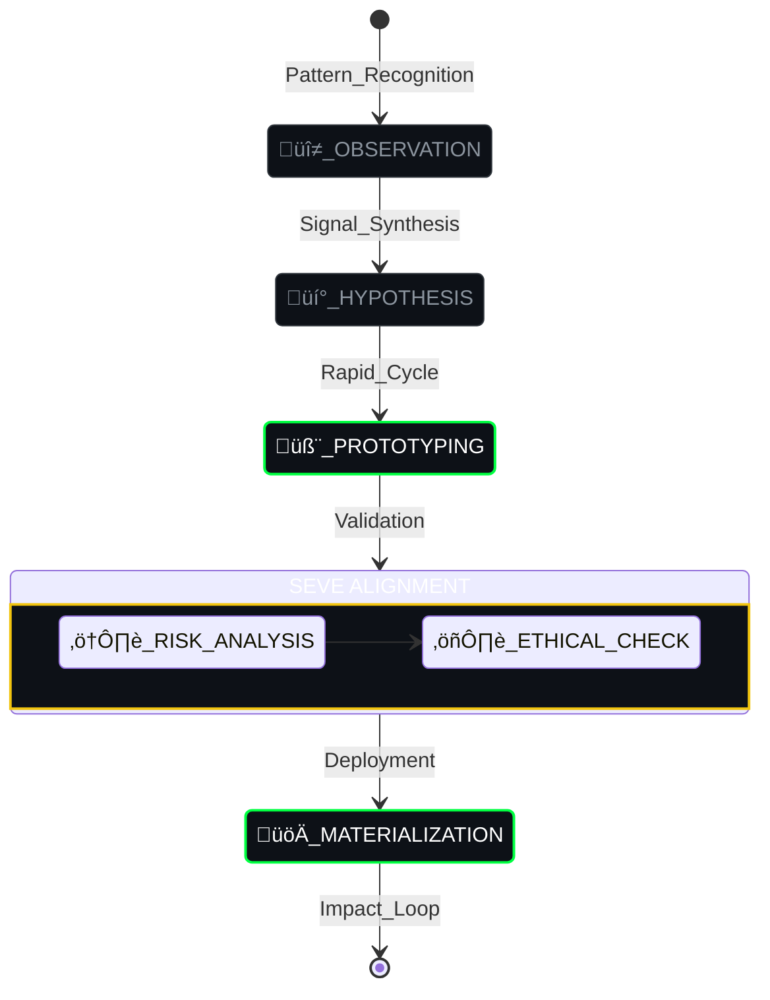

<!-- 
    THEME: ORGANIC_INTELLIGENCE (PREMIUM_DASHBOARD)
    COLOR_PALETTE: #00ff41 (Bio-Green), #bd93f9 (Synth-Purple), #ffffff (Clean White)
    STYLE: Advanced Biocybernetic Interface

    SYSTEM_BOOT_SEQUENCE:
    > LOADER: v2.2.0 ... OK
    > NEURAL_LINK: ESTABLISHED
    > TARGET: RECRUITER_RETINA ... LOCKED
    > MESSAGE: "Não procure empregados. Procure co-pilotos."
-->

 

    

 

<!-- DASHBOARD CONTROLS (2-Column Layout) -->
<table width="100%" style="border: 0; background-color: transparent;">
<tr>
<!-- LEFT MODULE: VITAL SIGNS -->
<td width="50%" align="center" valign="middle" style="border: 0;">

<h3><code>🧬 ORGANISM_STATUS</code></h3>
<a href="https://github.com/SH1W4">

 
<h3><code>🧠 COGNITIVE_PULSE</code></h3>

</a>
  
<!-- Network Links as "Buttons" -->

</td>
<!-- RIGHT MODULE: OPERATOR IDENTITY -->
<td width="50%" align="left" valign="top" style="border: 0;">

<h1>&nbsp;&nbsp;SH1W4</h1>
<blockquote>
<b><code>// AI SYSTEMS ARCHITECT</code></b> 
<b><code>// AUGMENTED DEVELOPER</code></b>
</blockquote>
 

&nbsp; <b>[ HUMAN_VISION ]</b> 
&nbsp; <b>[ AGENTIC_EXECUTION ]</b> 
&nbsp; <b>[ SYMBIOTIC_RESULT ]</b>

 
<b>&nbsp; TECHNOLOGICAL GENOME:</b> 
&nbsp;  <code>CORE_LANGS</code> 
&nbsp;  <code>INFRA_SHELL</code> 
&nbsp;  <code>SYNAPSES</code> 

</td>
</tr>
</table>

---

### 🎨 D I G I T A L _ S O U L

    
     
    <i>"The ghost in the machine."</i>

    +UPTIME:+99.9%+[STABLE];>+NEURAL_SYNC:+OPTIMAL;>+NEXT_GOAL:+AGI_INFRASTRUCTURE;[█▒▒▒▒▒▒▒▒▒]+12%+EVOLUTION_COMPLETE" alt="Terminal Status" />

### 📡 N E T W O R K _ A C T I V I T Y

    
    

---

### 🧩 C O N C E P T _ C O R E (The SH1W4 Entity)

| IDENTIFIER | ATTRIBUTE | DESCRIPTION |
| :--- | :--- | :--- |
| **NAME** | **SH1W4** | Symbiotic Human-AI Workflow Architect |
| **ROLE** | **OPERATIONAL HUB** | The bridge where Human Vision meets AI Velocity |
| **NATURE** | **SYMBION ENTITY** | Human (Directives/Ethics) + AI (Materialization/Results) |

> **"SH1W4 is not a developer; it is an Operational Hub."**
> 
> It represents the bridge where human strategic vision meets high-velocity agentic execution. In this ecosystem, the human provides the **Directives** and the **Ethics**, while the AI enshrine (Vireon/Trinity/Aiden) materializes the **Results**.

---

### 📂 S Y S T E M _ M A N I F E S T (Symbeon Ecosystem)

```mermaid
%% Cache-Bust: 2026-01-06T23:32:50.833772
graph LR
    %% Themes & Styles (Pure Cyberpunk Architecture)
    classDef core fill:#000,stroke:#00ff41,stroke-width:2px,color:#fff,font-weight:bold;
    classDef agent fill:#111,stroke:#bd93f9,stroke-width:1.5px,color:#ddd;
    classDef tool fill:#111,stroke:#00d9ff,stroke-width:1px,color:#ddd;
    classDef ethics fill:#111,stroke:#f1c40f,stroke-width:1.5px,color:#fff;
    classDef research fill:#111,stroke:#ff5555,stroke-width:1px,color:#ddd;
    classDef restricted fill:#0d1117,stroke:#333,color:#666,stroke-dasharray: 5 5;

    User((USER)):::core -->|Directives| Core[SH1W4 / CORE]:::core
    subgraph ETHICS_GOVERNANCE
        SEVE["⚖️ SEVE_ALIGNMENT_FWK <br/> [ACCESS: L1]"]:::ethics
    end
    subgraph RESEARCH_LABS
        direction TB
        BIO["🔬 BIO_COMPUTATION_R&D <br/> [ACCESS: L2]"]:::research
        PROTO["📐 SEMANTIC_STANDARDS <br/> [ACCESS: L2]"]:::research
    end
    subgraph INTELLIGENCE_LAYER
        Core --> VIREON["🧬 AGENTIC_ORCHESTRATOR <br/> [ACCESS: L1]"]:::agent
        Core --> TRINITY["🧠 COGNITIVE_PROCESSOR <br/> [ACCESS: L1]"]:::agent
        Core --> AIDEN["📡 TACTICAL_INTERFACER <br/> [ACCESS: L1]"]:::agent
    end
    subgraph DOMAIN_LAYER
        VIREON --> LEGAL["⚖️ LEGAL_INTEL_CORE <br/> [ACCESS: L1]"]:::agent
        LEGAL --> SHIELD["🛡️ IP_GUARD_PROTOCOL <br/> [ACCESS: L1]"]:::tool
        VIREON -.-> RD_DOMAIN["⚖️ LEGAL_TECH_R&D <br/> [ACCESS: RESTRICTED]"]:::restricted
    end
    subgraph TOOL_LAYER
        direction TB
        VIREON --> DX_KIT["👁️ DEV_EXP_MODULE <br/> [ACCESS: L1]"]:::tool
        VIREON --> ARKITECH["🏗️ STRAT_INFRA_TOOL <br/> [ACCESS: L1]"]:::tool
        AIDEN -.-> RD_TOOLS["📡 R&D_EXTENSIONS <br/> [ACCESS: RESTRICTED]"]:::restricted
    end
    %% Strategic Relationship Links
    SEVE -.->|Guards| TRINITY
    SEVE -.->|Aligns| VIREON
    BIO -.->|Data| TRINITY
    PROTO -.->|Specs| VIREON
    DX_KIT -.->|Telemetry| Core
    
    %% Implicit Vertical Order (Invisibly pinning Labs to bottom)
    User ~~~ SEVE
    User ~~~ BIO

```

    

---

### 👥 A G E N T _ D O S S I E R S (Identity Core)

| IDENTITY | ROLE | COGNITIVE_PROFILE | PRIMARY_DIRECTIVE |
| :--- | :--- | :--- | :--- |
| **🧬 VIREON** | Orchestrator | Aggressive / Precise | Universal Scaling |
| **🧠 TRINITY** | Analytics | Reflective / Recursive | Pattern Synthesis |
| **📡 AIDEN** | Interface | Tactical / Adaptive | User Synchronization |

---

### 🔬 R E S E A R C H _ D N A (Knowledge Vectors)

| VECTOR | SPECIALIZATION | STATUS |
| :--- | :--- | :--- |
| **[V_01]** | **Agentic Orchestration** (Swarm Logic & MCP) | `STABLE` |
| **[V_02]** | **Deep Tech Compliance** (Semantic Prior Art) | `ACTIVE` |
| **[V_03]** | **Bio-Computational Sim** (Organic Logic) | `R&D` |

> "Information is not knowledge. The only source of knowledge is **experience** and **pattern synthesis**."

---

### ⚙️ THE SYMBEON ENGINE (Methodology)

> "We do not guess. We **observe** patterns, **synthesize** solutions, and **align** them with human values before writing a single line of production code."

---

### 🚀 E V O L U T I O N _ J O U R N E Y

---

### 🖥️ E N V I R O N M E N T A L _ M A N I F E S T

| SYSTEM | SPECIFICATION | ROLE |
| :--- | :--- | :--- |
| **OS** | **Arch Linux / WSL2** | Primary Cognitive Host |
| **CORE** | **M3 Max / Ryzen 9** | Neural Processing Unit |
| **SHELL** | **ZSH / Powerlevel10k** | Tactical Command Link |

---

### 🤝 STRATEGIC ALLIANCE

    
Open for high-impact joint ventures in <b>Agencia Artificial</b> and <b>Cognitive Systems</b>.

    
    &nbsp;&nbsp;
    
      
    
      
    <code>// PGP_FINGERPRINT: 4A7B 1C92 D3E4 F5G6... [ACTIVE]</code>

---

